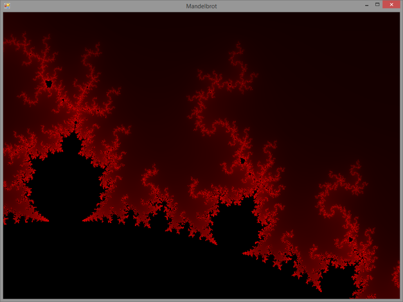

Mandelbrot
==========

The Mandelbrot set rendered on a Windows Form in C#. Because why not. 

### License

The project is licensed under the [EUPL v.1.1](https://joinup.ec.europa.eu/software/page/eupl/licence-eupl), a copy of which can be found in [LICENSE.md](LICENSE.md).